# Minimal Niri Rice for Arch Linux

A **minimal, practical rice** built around **niri** for **Arch Linux and
Arch-based distributions**.

This setup is for people who want a system that is:

- simple and clean
- easy to understand and modify
- free of heavy abstraction layers
- stable over time
- not split across hundreds of confusing directories

This rice is intentionally **boring in the good way**: predictable,
readable, and easy to own.

---

## Why This Exists

I used **[HyDE](https://github.com/HyDE-Project/HyDE)** for about **1.5
years**.

It is a powerful and visually impressive project, but over time it
became frustrating to maintain *my own* workflow on top of it.

Issues I personally ran into:

- frequent breaking changes
- constantly shifting “recommended” ways of doing things
- deep abstraction layers
- tight coupling between internal tools
- replacing individual components felt harder than it should be

When I discovered **niri**, it gave me a reason to leave Hyprland and
start fresh with **my own dotfiles**, focused on **clarity over
cleverness**.

---

## Preview

<!-- Wallpapers -->
<table>
  <tr>
    <td>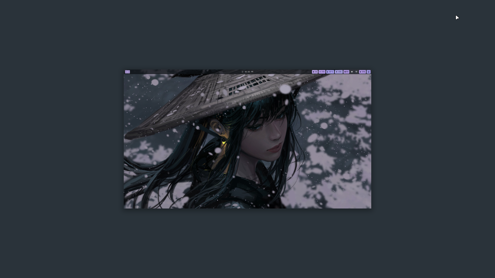</td>
    <td>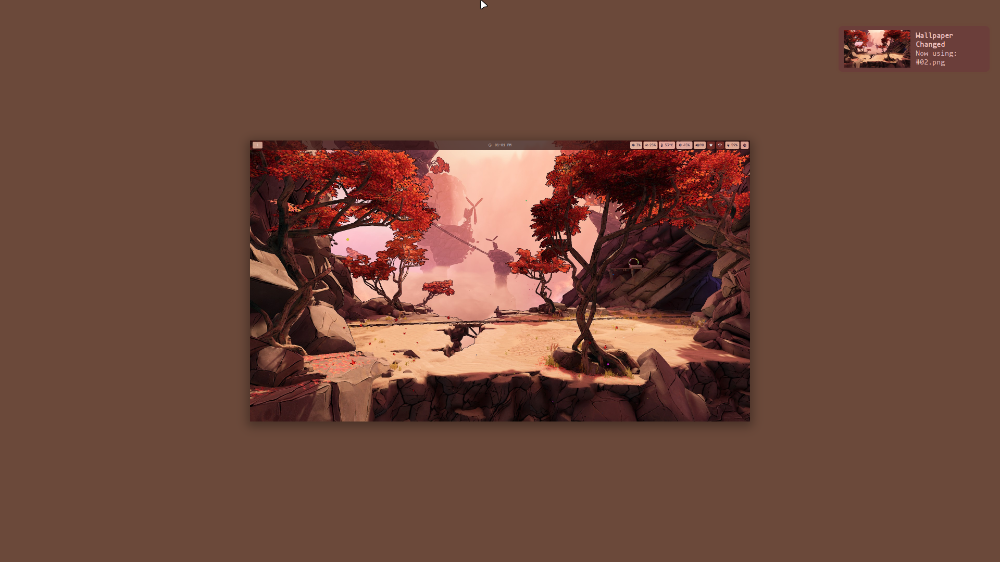</td>
  </tr>
  <tr>
    <td>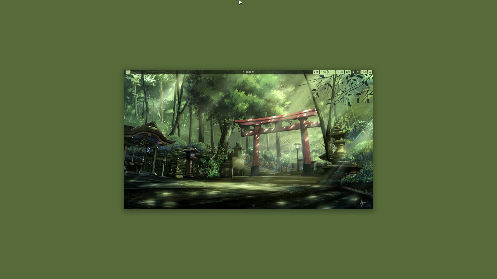</td>
    <td>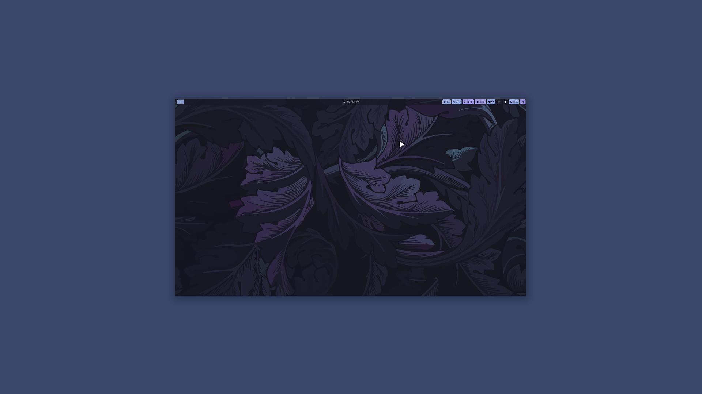</td>
  </tr>
</table>

<!-- App Screenshots -->
<table>
  <tr>
    <td>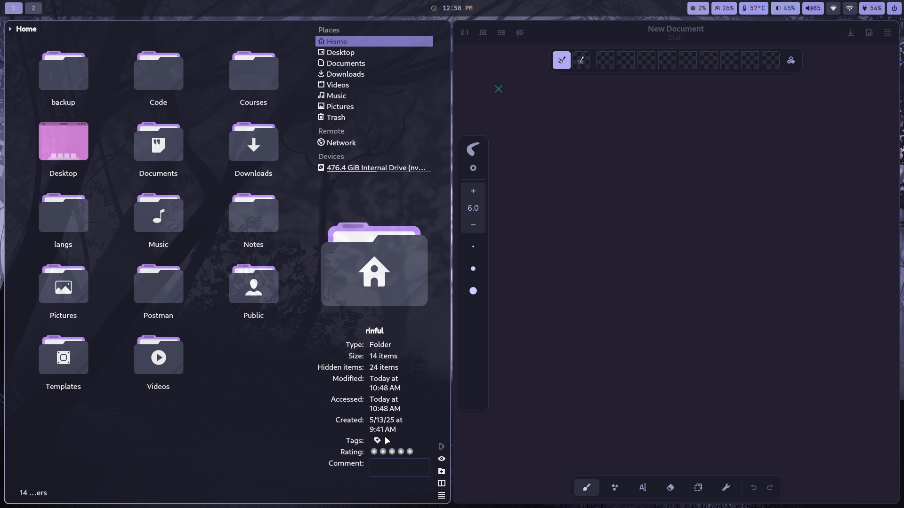</td>
    <td>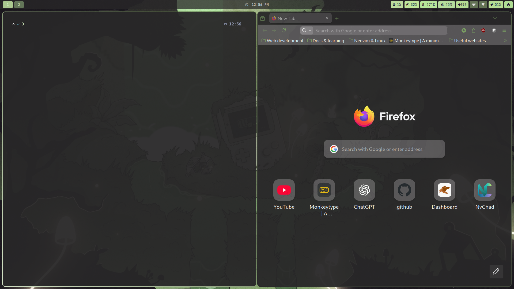</td>
    <td>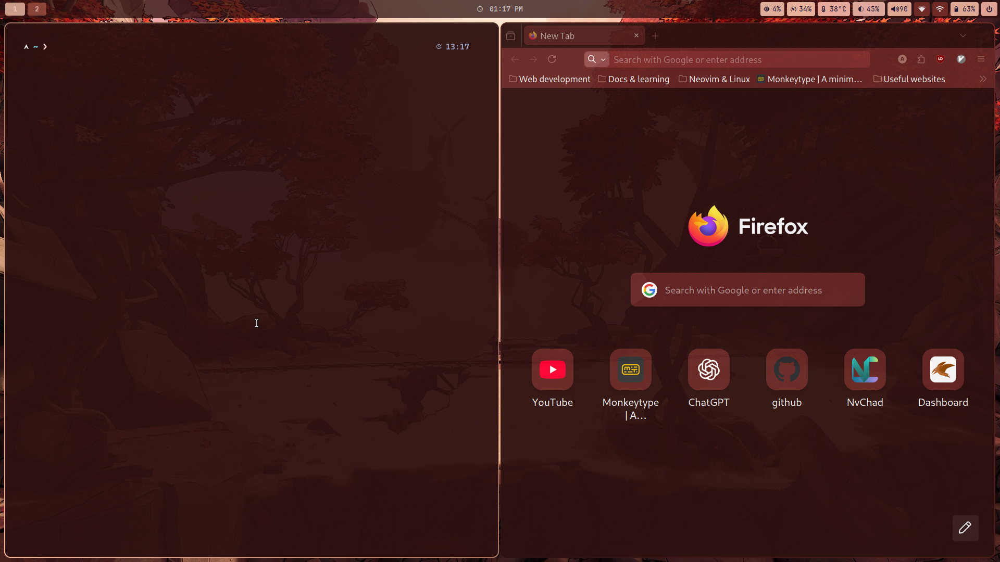</td>
  </tr>
  <tr>
    <td>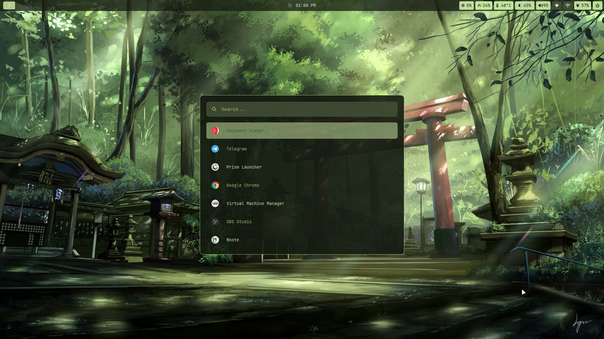</td>
    <td>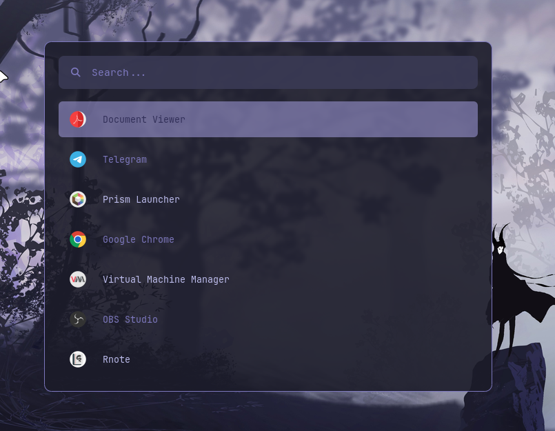</td>
    <td>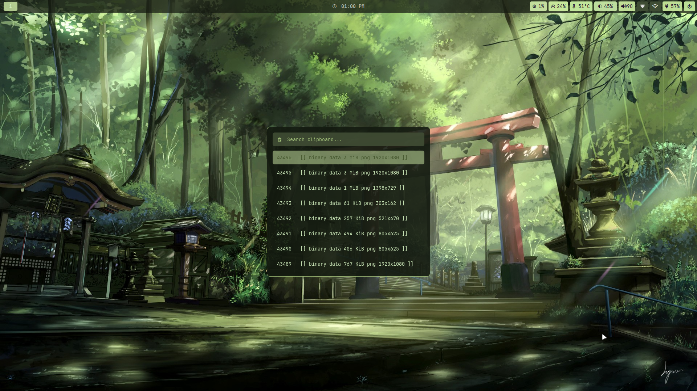</td>
  </tr>
  <tr>
    <td>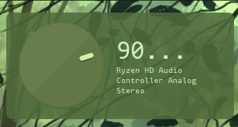</td>
    <td>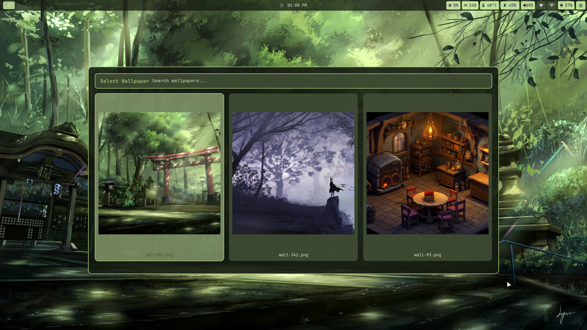</td>
  </tr>
</table>

---

## Installation

**Recommended:** clean, minimal Arch Linux install  
**Possible:** existing system (only if you know what you’re doing)

```bash
git clone --depth=1 https://github.com/0xrinful/dotfiles
cd dotfiles
./install.sh
```

After installation:

- **Reboot** (recommended)  
  **or**
- logout and log back in

Then run (one time only):

```bash
./init.sh
```

> `init.sh` is required only once.  
> You do not need to run it again afterward.

---

## ⚠️ Important Notes

- This setup **will overwrite existing configuration files**
- Make backups before running `install.sh`
- The scripts assume:
  - a Wayland session
  - systemd
  - no conflicting compositor setup

If you want a “safe to run anywhere” installer, this is **not** that.

---

## Repository Structure

```text
.
├── install.sh         # Installs the rice and sets up packages
├── packages.txt       # List of packages to install
├── config/            # User configuration files (mirrors home)
│   ├── .config/       # Application configs
│   │   ├── kitty/     # Terminal configuration
│   │   ├── niri/      # Niri configuration
│   │   ├── rofi/      # Launcher configuration
│   │   ├── swww/      # Wallpapers (you can add walls here)
│   │   ├── zsh/       # Zsh shell configuration
│   │   └── waybar/    # Waybar config and style
│   ├── .local/
│   │   └── bin/       # Custom scripts used by this rice
│   ├── .gtkrc-2.0
│   └── .zshenv

```

### Notes

- The `.local/bin` folder is added to your `PATH` in `.zshenv`, making all scripts inside accessible from anywhere on the system. You can put your own custom shell scripts here.

- The `.config/zsh` folder contains the Zsh shell configuration. It is also referenced in `.zshenv`. If you don’t like this location, you can change it.

- The Zsh config comes preloaded with useful tools and enhancements such as **zoxide**, **fzf**, and tab completion.

---

## Core Components

This rice intentionally uses well-known, replaceable tools:

- **Terminal:** Kitty
- **File Manager:** Dolphin
- **Bar:** Waybar
- **Launcher:** Rofi
- **Wallpaper Daemon:** swww
- **Logout Menu:** Wlogout

Any of these can be replaced without breaking the setup.  
Color templates are provided to integrate new tools into the system-wide
color scheme.

*(Detailed documentation for color templates will be added later.)*

---

## Firefox Theming (Optional)

To make Firefox follow the system color scheme:

1. Install the **Pywalfox** extension from Firefox Add-ons
  
2. Install the backend:
  
  ```bash
  yay -S python-pywalfox
  ```
  
3. Run:
  
  ```bash
  pywalfox install
  ```
  

Firefox will now match your system colors.

---

## Non-Goals

This project does **not** aim to:

- be a full desktop environment
- provide a GUI installer
- auto-adapt to every possible setup
- chase the latest Wayland trends

If you want those things, this repository is probably not for you — and
that’s intentional.

---

## Credits & Inspiration

This project takes **significant inspiration** from:

- https://github.com/HyDE-Project/HyDE

While this is **not a fork**, many ideas, scripts, and workflows were
influenced by HyDE.

---

## Final Note

This is a personal setup, shared because others might find it useful.

Read the scripts. Understand what they do. Modify them to fit *your*
workflow.

That is the whole point.
